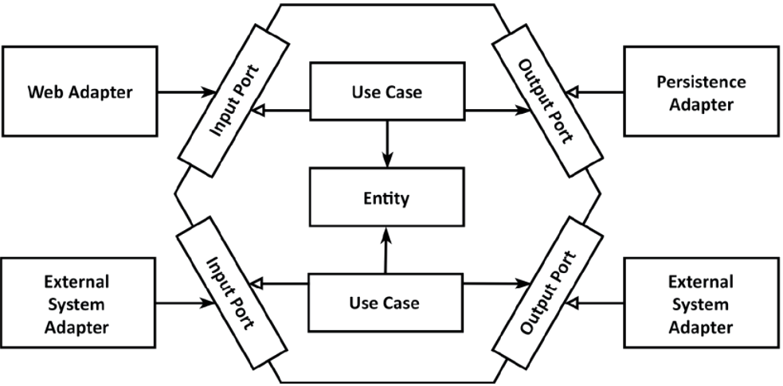

# XOF API v1.2.1

[](https://codecov.io/gh/dan-zx/xof-api)
[](https://travis-ci.com/dan-zx/xof-api)
[](https://www.apache.org/licenses/LICENSE-2.0.html)

A Blog application API created following the clean architecture and clean code

Architecure
-----------




Modules
-------

* `xof-core`: contains the business logic, use cases and domain entities. Exports the output ports for persistence
* `xof-persistence`: implements the output ports of the core module as JPA repositories/entities
* `xof-rest-api`: creates the input ports as a REST API
* `xof-app`: contains the configuration to set up the application


Prerequisites
-------------

  * JDK11+

Build the project
-----------------

```sh
$ ./gradlew clean build
```

Start endpoints
---------------

```sh
$ ./gradlew :xof-app:bootRun
```

Swagger docs should be at [http://localhost:8080/swagger-ui.html](http://localhost:8080/swagger-ui.html)


License
-------

    Copyright 2020 Daniel Pedraza-Arcega

    Licensed under the Apache License, Version 2.0 (the "License");
    you may not use this file except in compliance with the License.
    You may obtain a copy of the License at

       http://www.apache.org/licenses/LICENSE-2.0

    Unless required by applicable law or agreed to in writing, software
    distributed under the License is distributed on an "AS IS" BASIS,
    WITHOUT WARRANTIES OR CONDITIONS OF ANY KIND, either express or implied.
    See the License for the specific language governing permissions and
    limitations under the License.
